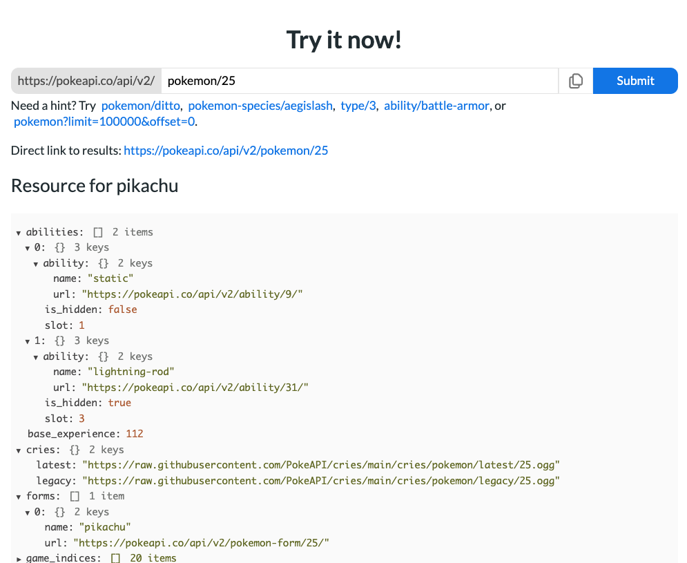
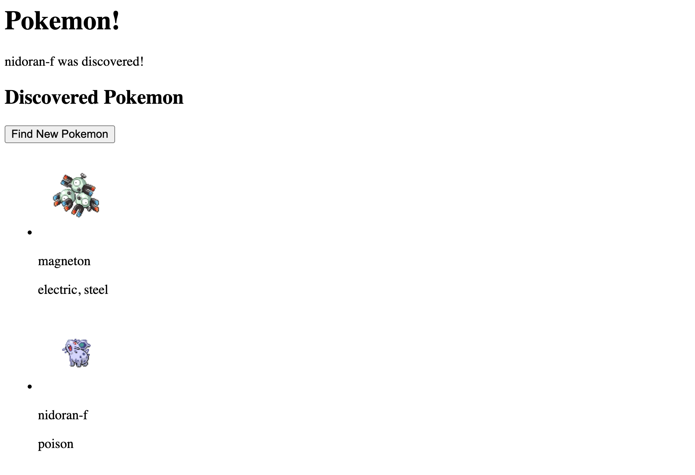
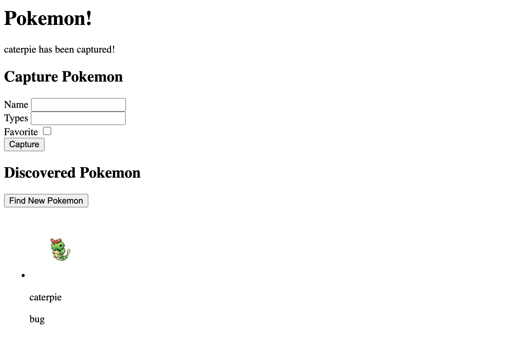

# Assignment 4.3 - PokéCatch (Vite + Fetch + Forms)

**Table of Contents**
- [Reminders](#reminders)
- [Setup](#setup)
- [Short Response](#short-response)
- [Code](#code)
  - [The API](#the-api)
  - [Overview](#overview)
  - [Part 1) Fetching Pokémon](#part-1-fetching-pokémon)
    - [Step 1A: Write the HTML (4 points)](#step-1a-write-the-html-4-points)
    - [Step 1B: Fetch A Random Pokémon (9 points)](#step-1b-fetch-a-random-pokémon-9-points)
    - [Step 1C: Render DOM Helpers (12 points)](#step-1c-render-dom-helpers-12-points)
    - [Step 1D: Main App Logic (8 points)](#step-1d-main-app-logic-8-points)
  - [Part 2) Formspree Form (Catching Pokémon)](#part-2-formspree-form-catching-pokémon)
    - [Step 2A: Write the HTML (7 points)](#step-2a-write-the-html-7-points)
    - [Step 2B: Post a Discovered Pokémon (7 points)](#step-2b-post-a-discovered-pokémon-7-points)
    - [Step 2C: Handle Form Submission (6 points)](#step-2c-handle-form-submission-6-points)
- [Debugging Tips:](#debugging-tips)

## Reminders

**<details><summary>Asking ChatGPT for Help</summary>**

If you're stuck, you may use ChatGPT to clarify the assignment — but not to solve it for you. To do this, copy the meta-prompt below into ChatGPT along with the assignment question.

> You are acting as a tutor. Your job is to explain what this coding question is asking, clarify confusing wording, and highlight the relevant concepts students need to know — but do not provide the full solution or code that directly answers the question. Instead, focus on rephrasing the problem in simpler terms, identifying what's being tested, and suggesting what steps or thought processes might help. Ask guiding questions to ensure the student is thinking critically. Do not write the final function, algorithm, or code implementation.

Be mindful of your AI usage on assignments. AI can be a great tool to help your learning but it can also be detrimental if you let it do too much of the thinking for you.

</details>

**<details><summary>Be Okay With Being "Provisionally Complete"</summary>**

At Marcy, we will deem an assignment as "complete" if you satisfy the requirements listed below. 

However, we know many of you will feel the urge to hold off on submitting until your assignment feels 100% perfect. That drive for excellence is an asset!

But perfectionism can also get in the way of learning — especially when we need to cover a lot in a short amount of time.

That's why we encourage you to be comfortable with being **"provisionally complete."** This means:

- Submitting your work even if it isn't perfect yet
- Treating submission as a checkpoint, not a finish line
- Committing to return, revise, and improve later

Learning to move forward with provisional completeness will help you make steady progress while still building the habit of continuous improvement.

</details>

## Setup

For guidance on setting up and submitting this assignment, refer to the Marcy Lab School Docs How-To guide for [Working with Short Response and Coding Assignments](https://marcylabschool.gitbook.io/marcy-lab-school-docs/how-tos/working-with-assignments#how-to-work-on-assignments).

You are building a **Vite** project from scratch. Do not use `file://` or Live Server.

Here are some useful commands to remember:

```sh
git checkout -b draft   # switch to the draft branch before starting

npm create vite@latest  # create a Vite project
npm i                   # install dependencies
npm run dev             # start Vite dev server

git add -A              # add a changed file to the staging area
git commit -m 'message' # create a commit with the changes
git push                # push the new commit to the remote repo
```

First, clean up the given starter code and create this file structure:

```
index.html
src/
- main.js
- dom-helpers.js    <-- contains functionality for rendering data
- fetch-helpers.js    <-- contains functionality for fetching
```

When you are finished, create a pull request and tag your instructor for review.

## Short Response

There are 6 short response questions for you to answer. Each one is worth 6 points (3 points for writing quality and 3 points for technical content).

The questions assess your knowledge of:
1. Promise Chaining
2. Development Servers and CORS
3. The `fetch` Response Object
4. Async/Await Conversion
5. `event.preventDefault()` and Form Handling
6. Putting It All Together

## Code

### The API
For this assignment, you will use this `/pokemon/{id}` endpoint from the [PokeAPI](https://pokeapi.co/) API. Visit the website in the browser to read their documentation. The homepage has a section for you to test out this exact endpoint.

Try the `pokemon/25` endpoint.



The `{id}` portion of the URL is called a **URL parameter** and it can be any valid number that corresponds to a specific Pokémon.

### Overview

Your task is to build a small Vite app that fetches a **random Pokémon (ID 1–150)** from the PokéAPI and renders that Pokémon's data in a list. Then, create a form that lets the user "catch" the Pokémon by submitting its data to Formspree.

You must use:
- Vite development server
- ES modules (`import` / `export`)
- `fetch()` with `async` / `await`
- Form handling with `preventDefault()`
- Submit form data to Formspree

CSS is not required for this project. Only functionality. Once you have completed the project's core functionality, you may style the project to your heart's content! But note that it will not contribute to your grade.

* **Scoring Total:** 53 points
  * **Part 1 Scoring Total:** 33 points
  * **Part 2 Scoring Total:** 20 points

--- 

### Part 1) Fetching Pokémon

Your first task is to build a web application that:
1. Randomly chooses an id between 1-150, fetches that Pokémon, and renders their data to the screen in a list of "Discovered Pokémon"
2. Fetches a new random Pokémon when the user clicks on a button and adds their data to the list

By the end of this section, your project may look like this:



See below for step-by-step instructions for completing this part of the assignment. Each checkbox represents a point that you can earn towards completing this assignment. 

You will:
1. Create the HTML structure
2. Create a helper function for fetching a random Pokémon
3. Create a helper function for rendering a Pokémon list item
4. Connect the pieces

---

#### Step 1A: Write the HTML (4 points)
In `index.html`, do the following:
- [ ] Create an empty `p#error` element (a paragraph with the id "error") in the HTML body to display an **error** message.
- [ ] Create an empty `p#success` element in the HTML body to display a **success** message.
- [ ] Create a `button#discover-button` element in the HTML body that lets the user click on the button to "encounter" a new random Pokémon. Add appropriate text content.
- [ ] Create a `ul#discovered-list` element in the HTML body where you will display the random Pokémon's data.

You may, but are not required to, add additional structure and headings.

---

#### Step 1B: Fetch A Random Pokémon (9 points)
In `src/fetch-helpers.js`, do the following:

- [ ] Create an async function called `getRandomPokemon()`. It should:
  - [ ] Pick a random ID between 1 and 150 (inclusive)
  - [ ] Fetch the Pokémon data using the API endpoint `https://pokeapi.co/api/v2/pokemon/{id}`
  - [ ] Look through the data and create an object `pokemonObj` with this structure:
      ```js
      { 
         name: "bulbasaur", 
         types: "grass, poison", 
         sprite: "https://raw.githubusercontent.com/..." 
      }
      ```
      Hint: What array methods can you use to get the types in this string?
  - [ ] Return an object `{ data: pokemonObj, error: null }` if the fetch succeeds
  - [ ] Return an object `{ data: null, error: error }` if the fetch fails
  - [ ] Use `try/catch`
  - [ ] Use `async/await`
- [ ] Export the function as a named export

> Tip: Use the PokeAPI documentation or `console.log()` the response data to explore the data's structure and find the data you need to display.

---

#### Step 1C: Render DOM Helpers (12 points)
In `src/dom-helpers.js`, do the following:

`renderPokemon()`:
- [ ] Create a function called `renderPokemon(pokemonObj)`. It should:
  - [ ] Build a list item using DOM methods that contains:
    - [ ] Pokémon's name (e.g. "Bulbasaur")
    - [ ] Pokémon's types (e.g. "grass, poison")
    - [ ] Pokémon's sprite image (e.g. "https://raw.githubusercontent...")
  - [ ] Append the list item to the `ul` created in step 1A for "discovered" Pokémon
- [ ] Export the function as a named export

`renderError()` & `renderSuccess()`:
- [ ] Create a function called `renderError(msg)`. It should:
   - [ ] Update the text content of the error element
- [ ] Create a function called `renderSuccess(msg)`. It should:
   - [ ] Update the text content of the success element
- [ ] Export both functions named exports

---

#### Step 1D: Main App Logic (8 points)

In `src/main.js`, do the following:

- [ ] Import your helper functions from `dom-helpers.js` and `fetch-helpers.js`
- [ ] Create an async function called `getAndRenderPokemon()`. It should:
  - [ ] Fetch a random Pokemon to get the `data` or the `error`.
  - [ ] If the fetch failed (the error exists), clear the success message and show the returned `error`
  - [ ] If the fetch was successful, use `renderPokemon()` to render the Pokémon data, 
  - [ ] If the fetch was successful, show a success message `"{Pokemon} was discovered!"` and clear the error message
- [ ] When the page loads, invoke `getAndRenderPokemon()`
- [ ] Add an event listener to the button that invokes `getAndRenderPokemon()`

***TIP: Test your error logic works by fudging the fetch URL.***

---

### Part 2) Formspree Form (Catching Pokémon)

Create a Formspree form called **"Discovered Pokemon"**. Copy your Formspree endpoint which should look like this:

```
https://formspree.io/f/YOUR_FORM_ID
```

Your task is to create a form that lets the user submit data about the Pokémon they encounter and “capture” them. They can also indicate whether or not
the Pokémon is a favorite.

By the end of this section, your project may look like this:



See below for step-by-step instructions for completing this part of the assignment. Each checkbox represents a point that you can earn towards completing this assignment. 

You will:
1. Create the HTML structure
2. Create a helper function for posting a captured Pokémon
3. Handle the form submission and connect the pieces

---

#### Step 2A: Write the HTML (7 points)

In `index.html`, do the following:

- [ ] Near the top of the page (inside `body`), add a form with the following fields: `name`, `types`, and `isFavorite`
   - [ ] Each form field has a `label` and is wrapped in a `div`
   - [ ] Each form field has a `name` attribute
   - [ ] The form has a heading that describes the form's purpose
   - [ ] The form has a button to "capture" the Pokémon.

---

#### Step 2B: Post a Discovered Pokémon (7 points)

In `src/fetch-helpers.js`, do the following:

- [ ] Create an async function called `postDiscoveredPokemon(formData)`. It should:
   - [ ] Send a **POST** request to your Formspree endpoint
   - [ ] Use `fetch()` with method: **"POST"**
   - [ ] Send JSON in the request body (use `JSON.stringify`)
   - [ ] Include headers for JSON:
      ```js
      headers: {
         "Content-Type": "application/json",
         "Accept": "application/json"
      }
      ```
   - [ ] Use `try`/`catch`
   - [ ] Return `{ data: responseData, error: null }` if successful
   - [ ] Return `{ data: null, error: error }` if it fails
- [ ] Export the function as a **named export**

---

#### Step 2C: Handle Form Submission (6 points)

In `src/main.js`, do the following:

- [ ] Add an event listener to capture submissions to your form
- [ ] Inside the handler:
   - [ ] Call `event.preventDefault()`
   - [ ] Extract the form data (you may use `FormData` or `form.elements`)
   - [ ] Convert the `isFavorite` checkbox value to a **boolean**
   - [ ] Call `postDiscoveredPokemon(formValues)`
   - [ ] If the request succeeds, show a success message `"{name} has been captured!"` (use the existing success/error `p` elements)
   - [ ] If it fails, show an error message `"Error: unable to capture Pokémon. Please try again later"` (use the existing success/error `p` elements)
   - [ ] Reset the form after a successful submission

---

## Debugging Tips:
If you get stuck, debug in this order:
1. Check the browser console for errors
2. Confirm Vite dev server is running
3. Confirm your `fetch()` URL is correct
4. Confirm your Formspree URL is correct
5. Console.log the data you think you’re passing
